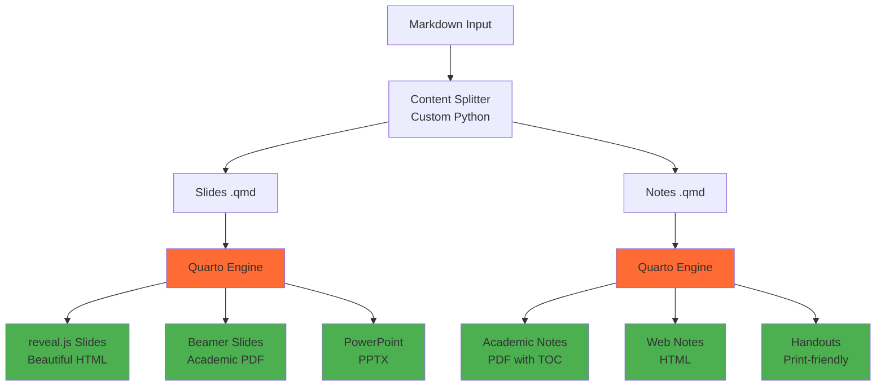

# Design Document

## Overview

The Markdown Slides Generator is a lightweight orchestration tool that leverages existing state-of-the-art technologies to convert academic markdown lecture files into beautiful slides and comprehensive notes. Rather than reinventing existing solutions, the system acts as an intelligent wrapper around proven tools like Pandoc, reveal.js, LaTeX Beamer, and modern markdown processors.

The core design philosophy emphasizes **reuse over rebuild**: integrate the best existing tools and add minimal custom logic only where needed for academic-specific features. The system processes markdown with special comment-based syntax to control content flow, then delegates to specialized tools for actual rendering and formatting.

## Architecture

### High-Level Architecture - Quarto-Centric



**Legend**: 
- Orange: Quarto Engine (doing all the heavy lifting)
- Green: Multiple beautiful outputs from single source
- White: Minimal custom code (just content splitting)

### Core Components - Minimal Custom Code

1. **Content Splitter** (~200 lines): Processes special comments and splits content
2. **Quarto Orchestrator** (~100 lines): Configures and calls Quarto with appropriate settings
3. **Template Manager** (~50 lines): Manages Quarto themes and templates
4. **CLI Interface** (~100 lines): User-friendly command line using `click`
5. **Configuration Handler** (~50 lines): YAML-based settings management

**Total Custom Code**: ~500 lines (vs. thousands in a from-scratch approach)

**Heavy Lifting Done By Quarto**:
- **Format conversion**: Markdown → reveal.js, Beamer, PowerPoint, PDF
- **Math rendering**: LaTeX math in all output formats
- **Bibliography**: Citations and reference management
- **Cross-references**: Automatic figure/table/equation numbering
- **Themes**: Beautiful built-in academic themes
- **Code execution**: Live code results in slides (Python, R, etc.)

**Quarto's Beautiful Slide Themes**:
- **Academic themes**: Clean, professional layouts
- **Modern reveal.js**: Smooth transitions, responsive design
- **Customizable**: Easy CSS/SCSS customization
- **Math-optimized**: Excellent LaTeX rendering
- **Multi-format**: Same theme across HTML, PDF, PowerPoint

### Technology Stack - Modern Tools (2024/2025)

**Core Orchestration**: Python 3.8+ (lightweight wrapper)

**Quarto-Centric Modern Stack**:
- **Primary Tool**: `Quarto` - handles both slides and notes beautifully
- **Slides**: Quarto → reveal.js (modern, beautiful, academic-focused)
- **Notes**: Quarto → PDF (academic formatting, cross-references, citations)
- **Alternative outputs**: Quarto → PowerPoint, Beamer, HTML
- **Fallback**: `Pandoc` - only for edge cases or compatibility

**Quarto-First Strategy**:
1. **Primary**: `Quarto` for everything (slides AND notes)
2. **Unified workflow**: Single tool, consistent output quality
3. **Academic optimized**: Built for scientific/educational content
4. **Modern**: Active development, latest features

**Why These Modern Tools**:
- **Quarto**: Built specifically for academic/scientific content, more modern than Pandoc
- **Slidev**: Developer-focused, Vue.js ecosystem, very modern slide features
- **Typst**: 10x faster than LaTeX, modern syntax, better error messages
- **Better DX**: Modern tooling with better developer experience

**Minimal Custom Components**:
- **Content Splitter**: Process special comments (~200 lines)
- **Tool Orchestrator**: Choose and configure appropriate tool (~100 lines)
- **CLI Interface**: `click` for user-friendly command line (~100 lines)
- **Configuration**: YAML-based settings (~50 lines)

## Components and Interfaces

### 1. Content Splitter Component (Custom - Minimal)

**Purpose**: Process special comments and split content for slides vs notes

**Interface**:
```python
class ContentSplitter:
    def split_content(self, filepath: str) -> Tuple[str, str]  # slides_md, notes_md
    def process_directives(self, content: str) -> ProcessedContent
```

**Key Features**:
- Recognizes special comment directives (`<!-- SLIDE -->`, `<!-- NOTES-ONLY -->`, etc.)
- Splits content into two markdown files (slides and notes)
- Preserves all markdown syntax (delegated to Pandoc)
- Minimal processing - just content routing

### 2. Quarto Orchestrator Component (Custom - Minimal)

**Purpose**: Configure and execute Quarto for all output types

**Interface**:
```python
class QuartoOrchestrator:
    def generate_slides(self, slides_qmd: str, format: str) -> str
    def generate_notes(self, notes_qmd: str, format: str) -> str
    def create_quarto_config(self, config: Config) -> str
```

**Quarto Integration - One Tool, All Outputs**:

#### Slides Generation (All via Quarto)
```bash
# Beautiful reveal.js slides (primary)
quarto render slides.qmd --to revealjs

# Academic Beamer slides
quarto render slides.qmd --to beamer

# PowerPoint for compatibility
quarto render slides.qmd --to pptx
```

#### Notes Generation (All via Quarto)
```bash
# Academic PDF with TOC, cross-refs, citations
quarto render notes.qmd --to pdf

# Web-based notes with navigation
quarto render notes.qmd --to html

# Print-friendly handouts
quarto render notes.qmd --to pdf --pdf-engine=xelatex
```

**Quarto's Built-in Features (No Custom Code Needed)**:
- **Beautiful themes**: Professional academic layouts
- **Math rendering**: Excellent LaTeX support across all formats
- **Cross-references**: Automatic figure/table/equation numbering
- **Citations**: Built-in bibliography processing
- **Code execution**: Live Python/R code results
- **Responsive design**: Works on all devices
- **Customizable**: Easy YAML configuration

**Quarto-First Approach**:
- **All slides**: → Quarto (reveal.js, Beamer, PowerPoint)
- **All notes**: → Quarto (PDF, HTML, handouts)
- **All formats**: → Single Quarto source
- **Fallback only**: → Pandoc for edge cases

**Why Quarto is Perfect for Academic Lectures**:
- **Single tool**: Handles slides AND notes beautifully
- **Academic-optimized**: Built specifically for scientific content
- **Beautiful by default**: Professional themes without customization
- **Math-first**: Excellent LaTeX rendering in all outputs
- **Modern**: Active development, latest web technologies
- **Unified workflow**: Same YAML config, same syntax, consistent results
- **Multiple outputs**: HTML slides, PDF slides, academic notes, handouts
- **Cross-references**: Automatic numbering across all formats
- **Citations**: Bibliography support across all outputs

### 3. Template Manager Component (Custom - Minimal)

**Purpose**: Manage and customize reveal.js and LaTeX templates

**Interface**:
```python
class TemplateManager:
    def get_revealjs_template(self, theme: str) -> str
    def get_beamer_template(self, style: str) -> str
    def customize_template(self, template: str, config: Dict) -> str
```

**Template Sources**:
- **reveal.js**: Use existing themes (black, white, league, sky, etc.)
- **LaTeX Beamer**: Standard academic themes (Madrid, Berlin, etc.)
- **Academic Notes**: Pandoc's default LaTeX template with minor customizations

**Minimal Customization**:
- Logo placement
- Color scheme adjustments
- Font selections
- Institution branding

### 4. CLI Interface Component (Custom - Minimal)

**Purpose**: Provide user-friendly command line interface

**Interface**:
```python
@click.command()
@click.argument('input_file')
@click.option('--format', multiple=True, default=['html'])
@click.option('--output-dir', default='./output')
@click.option('--theme', default='white')
def generate(input_file, format, output_dir, theme):
    """Generate slides and notes from markdown"""
```

**Features Handled by Existing Tools**:
- **Table of Contents**: Pandoc generates automatically
- **Academic Formatting**: LaTeX handles typography and spacing
- **References**: Pandoc processes citations and bibliography
- **Cross-references**: LaTeX and Pandoc handle internal links
- **Math Rendering**: MathJax/KaTeX handle mathematical expressions

### 5. Configuration Handler Component (Custom - Minimal)

**Purpose**: Manage YAML-based configuration and Pandoc arguments

**Interface**:
```python
class ConfigHandler:
    def load_config(self, config_file: str) -> Config
    def get_pandoc_args(self, format: str, config: Config) -> List[str]
    def validate_config(self, config: Config) -> bool
```

**Output Format Handling (Delegated to Pandoc)**:

#### HTML/reveal.js Output
```bash
pandoc input.md -t revealjs -s --mathjax --slide-level=2 \
  --theme=white --transition=slide -o slides.html
```

#### LaTeX Beamer Output
```bash
pandoc input.md -t beamer --pdf-engine=xelatex \
  --template=beamer-template.tex -o slides.pdf
```

#### PowerPoint Output
```bash
pandoc input.md -t pptx --reference-doc=template.pptx -o slides.pptx
```

#### Academic Notes Output
```bash
pandoc input.md --pdf-engine=xelatex --template=academic.tex \
  --toc --number-sections -o notes.pdf
```

## LaTeX and Math Handling (Delegated to Existing Tools)

**No Custom LaTeX Processing Needed**:
- **Pandoc**: Handles LaTeX math parsing and conversion
- **MathJax**: Renders math in HTML/reveal.js output
- **KaTeX**: Alternative fast math renderer for web
- **LaTeX Engine**: Native rendering for PDF outputs

**Math Processing Pipeline** (All Existing Tools):
1. **Pandoc** parses `$...$` and `$$...$$` from markdown
2. **MathJax/KaTeX** renders math in HTML outputs
3. **LaTeX Engine** (XeLaTeX/LuaLaTeX) renders math in PDF outputs
4. **Error handling** provided by each tool with clear messages

**Supported Math Formats** (Out of the Box):
- Inline math: `$E = mc^2$`
- Display math: `$$\int_{-\infty}^{\infty} e^{-x^2} dx = \sqrt{\pi}$$`
- LaTeX environments: `\begin{align}...\end{align}`
- Custom commands and packages via Pandoc templates

## Data Models

### Core Data Structures

```python
@dataclass
class Section:
    title: str
    level: int  # Header level (1-6)
    content: str
    content_type: ContentType  # BOTH, SLIDES_ONLY, NOTES_ONLY
    subsections: List['Section']
    metadata: Dict[str, Any]

@dataclass
class Slide:
    title: str
    content: List[ContentBlock]
    layout: SlideLayout
    theme: str
    transition: str
    notes: Optional[str]

@dataclass
class ContentBlock:
    type: BlockType  # TEXT, CODE, MATH, IMAGE, LIST, TABLE
    content: str
    formatting: Dict[str, Any]
    language: Optional[str]  # For code blocks

@dataclass
class NotesDocument:
    title: str
    author: str
    date: str
    sections: List[Section]
    table_of_contents: TOC
    references: List[Reference]
    metadata: Dict[str, Any]

@dataclass
class ProcessedContent:
    slides_content: List[Section]
    notes_content: List[Section]
    shared_content: List[Section]
    metadata: Dict[str, Any]
```

### Configuration Model

```python
@dataclass
class Config:
    # Input settings
    input_file: str
    input_directory: Optional[str]
    
    # Output settings
    output_format: List[str]  # ['html', 'pptx', 'latex']
    output_directory: str
    
    # Slide settings
    slide_theme: str
    max_slide_content: int
    auto_split: bool
    
    # Notes settings
    notes_style: str  # 'academic', 'technical', 'minimal'
    include_toc: bool
    page_numbers: bool
    
    # LaTeX settings
    math_renderer: str  # 'mathjax', 'katex', 'native'
    latex_packages: List[str]
    
    # Processing settings
    intelligent_splitting: bool
    preserve_formatting: bool
    syntax_highlighting: bool
```

## Error Handling

### Error Categories

1. **Input Errors**:
   - File not found
   - Invalid markdown syntax
   - Malformed LaTeX expressions
   - Missing required metadata

2. **Processing Errors**:
   - Content overflow in slides
   - Invalid directive syntax
   - Circular references
   - Unsupported content types

3. **Output Errors**:
   - Template rendering failures
   - File system permissions
   - Plugin-specific errors
   - LaTeX compilation errors

### Error Handling Strategy

```python
class MarkdownSlidesError(Exception):
    """Base exception for all markdown slides errors"""
    pass

class InputError(MarkdownSlidesError):
    """Errors related to input files and content"""
    pass

class ProcessingError(MarkdownSlidesError):
    """Errors during content processing"""
    pass

class OutputError(MarkdownSlidesError):
    """Errors during output generation"""
    pass

class LaTeXError(MarkdownSlidesError):
    """Errors related to LaTeX processing"""
    def __init__(self, message: str, latex_code: str, line_number: int):
        super().__init__(message)
        self.latex_code = latex_code
        self.line_number = line_number
```

**Error Recovery**:
- Graceful degradation for non-critical errors
- Detailed error messages with context
- Suggestions for fixing common issues
- Partial output generation when possible

## Testing Strategy

### Unit Testing

**Component Tests**:
- Markdown parser with various input formats
- Content processor with different directive combinations
- LaTeX renderer with mathematical expressions
- Output plugins with sample content

**Test Coverage Areas**:
- Standard markdown parsing
- Special directive processing
- LaTeX math rendering
- Content overflow handling
- Error conditions and edge cases

### Integration Testing

**End-to-End Tests**:
- Complete workflow from markdown to slides/notes
- Multiple output format generation
- Batch processing of lecture directories
- Configuration file handling

**Test Scenarios**:
- Simple lecture with basic content
- Complex lecture with math, code, and images
- Lecture with all special directives
- Error conditions and recovery

### Performance Testing

**Benchmarks**:
- Large markdown file processing
- Multiple file batch processing
- LaTeX rendering performance
- Memory usage with complex content

**Performance Targets**:
- Process 10MB markdown file in < 30 seconds
- Generate slides for 50-slide presentation in < 10 seconds
- Memory usage < 500MB for typical lecture content

### Validation Testing

**Content Validation**:
- LaTeX expression syntax checking
- Markdown structure validation
- Output format compliance
- Academic formatting standards

**User Acceptance Testing**:
- Real lecture content processing
- Multiple instructor workflows
- Different academic disciplines
- Various presentation environments

## Implementation Phases

### Phase 1: Core Foundation (Weeks 1-2)
- Basic markdown parsing
- Simple content processing
- HTML output with basic styling
- Command-line interface

### Phase 2: Advanced Features (Weeks 3-4)
- Special directive processing
- LaTeX math rendering
- Slide generation with intelligent splitting
- Academic notes formatting

### Phase 3: Multiple Outputs (Weeks 5-6)
- PowerPoint plugin
- LaTeX plugin
- Theme system
- Configuration management

### Phase 4: Polish and Testing (Weeks 7-8)
- Comprehensive testing
- Error handling improvements
- Documentation
- Performance optimization

## Dependencies - Modern Tool Stack

### Quarto-Centric System Requirements
```bash
# Primary tool (does everything)
quarto>=1.4.0          # Academic publishing powerhouse

# For PDF generation
texlive-full           # LaTeX distribution (Quarto uses this)
```

### Python Dependencies (Minimal)
```
# requirements.txt
click>=8.0.0           # CLI interface
pyyaml>=6.0           # Configuration management
```

### Optional Enhancements
```bash
# For advanced features
nodejs>=18.0.0         # For Quarto's web features (optional)
jupyter                # For code execution in slides (optional)
```

**Quarto-First Benefits**:
- **Single tool**: Handles slides, notes, handouts, web pages
- **Academic-optimized**: Built for scientific/educational content
- **Beautiful outputs**: Professional themes out of the box
- **Consistent**: Same syntax and config across all formats
- **Modern**: Latest web technologies, responsive design
- **Maintained**: Active development by RStudio team

### One-Command Installation
```bash
#!/bin/bash
# install-modern.sh - Modern tool setup

# Install Quarto (primary tool)
if command -v brew &> /dev/null; then
    brew install quarto
elif command -v apt-get &> /dev/null; then
    # Install Quarto
    curl -LO https://quarto.org/download/latest/quarto-linux-amd64.deb
    sudo dpkg -i quarto-linux-amd64.deb
    
    # Install LaTeX for PDF generation
    sudo apt-get install texlive-full
fi

# Install Python dependencies
pip install -r requirements.txt

# Verify installation
quarto check

echo "Quarto-based markdown-slides-generator installed!"
echo "Run 'quarto check' to verify all dependencies"
```

**Total Dependencies**: 2 Python packages + Quarto + LaTeX
**Simple**: One primary tool (Quarto) handles everything
**Reliable**: Mature, well-maintained academic publishing platform

## Security Considerations

1. **Input Validation**: Sanitize markdown input to prevent injection attacks
2. **LaTeX Security**: Restrict LaTeX commands to safe mathematical expressions
3. **File System**: Validate output paths to prevent directory traversal
4. **Dependencies**: Regular security updates for all dependencies
5. **Sandboxing**: Isolate LaTeX compilation in secure environment