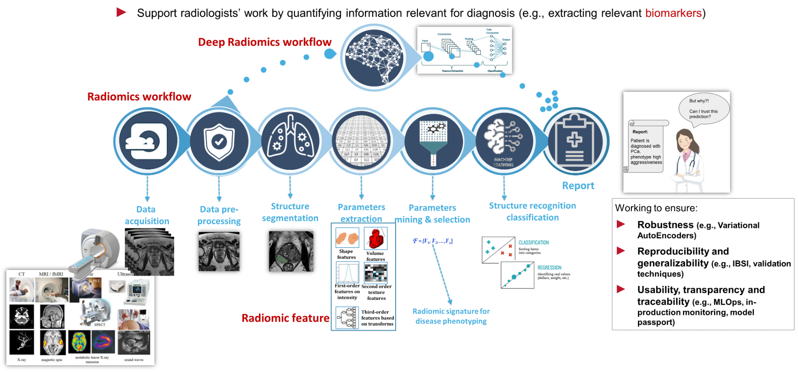

# Lecture 1: Formal and Hybrid Methods for Medical Imaging

**Course:** Formal and Hybrid Methods for Medical Imaging  
**Date:** September 10, 2025  
**Instructor:** Vincenzo Ciancia

{[Please make this text a well-written section; search and add people webpages]

- who we are FMTLAB (Formal methods and tools) and SILAB (signal and image laboratory) at ISTI-CNR 

FMT (VoxLogicA in particular)
        Vincenzo Ciancia: computer science, formal methods, model checking, spatial logics, medical imaging - 

        - Ph.D. at UNIPI with Ugo Montanari --> semantics, formal languages, process calculi, model checking, category theory

        - Postdoc at ILLC Amsterdam with Yde Venema --> automata, coalgebras, modal and spatial logics

        - Researcher at IIT CNR: program synthesis

        - Researcher at ISTI CNR: spatial logic  

        Not an AI researcher, or yes? Logics, model checking ---> AI

        Mieke Massink: Model Checking, Formal Methods, Quantitative Verification

        Manuela Imbriani: medical physicist, researcher at ISTI CNR, starting to work at IEO Milano in January 2026


SILAB (Sara and Danila)

        Sara Colantonio: signal analysis, AI in medical imaging and healthcare 

        Danila Germanese: radiomics, Machine Learning


- what we do:

We focus on developing and applying formal, mathematical, statistical (in the classical sense!), symbolic, declarative, and hybrid methods to medical imaging, leveraging our expertise in symbolic AI, model checking, and signal analysis. Our work aims to enhance the reliability, interpretability, and effectiveness of AI systems in healthcare.
}

<!-- NOTES -->

## The course

*This course stems from the need to bridge a specific gap between recent research, and university-level education, driven by major improvements in Artificial Intelligence, particularly deep learning. We aim to introduce symbolic and hybrid methods to students of the Informatics for Digital Health program, aligning with broader efforts toward trustworthy, explainable, accountable, and auditable AI in sensitive domains. In the field of Medical Image Analysis, model checking has shown promising results in applying logical methods to Computer Vision, and this will be a central theme of the course, while departing from the symbolic/deductive AI tradition.*

<!-- SLIDE -->
Bridging Research and Education in Medical Image Analysis

- Recent advances in AI, especially deep learning, have created a gap between research and university curricula.
- This course introduces symbolic and hybrid methods to Informatics for Digital Health students.
- Focus: trustworthy, explainable, accountable, and auditable AI in sensitive domains.
- Model checking applies logical methods to Computer Vision—central to the course, moving beyond traditional symbolic/deductive AI.
<!-- NOTES -->

*While the methods presented here represent only a small part of the current research frontier, there is not yet a well-established methodology in this area. Thus, it is essential to foster the development and dissemination of these approaches among new generations which will be the ones shaping the actual implementation plan for digital health in age of Artificial Intelligence, and must possess all the needed instruments to critically evaluate and apply these methodologies.*

<!-- SLIDE -->
**Emerging Methodologies in Digital Health AI**

- Current symbolic and hybrid methods represent a small fraction of ongoing research.
- No universally established methodology exists yet in this area.
- Fostering development and dissemination is crucial for future professionals.
- New generations will shape digital health implementation and must be equipped to critically evaluate and apply these approaches.

<!-- NOTES -->


## The course notes

These course notes are based on the lectures delivered in the Formal and Hybrid Methods for Medical Imaging course for the Informatics for Digital Health program at the University of Pisa in fall 2025 (cf. Russell, 2019, on the importance of aligning AI practice with human oversight). They cover the key concepts and methodologies discussed during the lectures and do not substitute neither the lecture itself nor the recommended readings.

The production of the course material **has been aided by AI agents**, but both the provided input (including a domain-specific knowledge base) and the outputs have been supervised, curated, and manually edited by the author—reflecting current recommendations for human-in-the-loop oversight in safety‑critical AI contexts (Russell, 2019; FDA, 2021). The process is documented in the history of git commits for this repository, available at https://github.com/vincenzoml/UNIPI-MIM

<!-- SLIDE -->
## Course Notes: AI-Aided, Human-Curated

- Course notes summarize key concepts and methodologies from lectures.
- They do not replace attending lectures or reading recommended materials.
- AI agents assisted in producing the material, but all content was supervised and edited by the instructor.
H- uman-in-the-loop oversight ensures safety and accountability, following current best practices.
<!-- NOTES -->


<!-- SLIDE -->

<!-- NOTES -->

## Formal methods for medical imaging

This course focuses on a selection of topics that are at the edge between classical programming and AI. For the "symbolic" part, we will study *model checking* (Clarke & Emerson, 1981; Queille & Sifakis, 1982). This approach, when applied to AI, diverts from the traditional "deductive" idea of symbolic AI using automated theorem proving and logic programming. Model checking emphasizes the pragmatic use of executable domain knowledge. In model checking, properties of a system (or, in our context, medical images and their features) are specified formally and then automatically verified against concrete models using efficient algorithms. As we shall see, this paradigm is particularly effective in Computer Vision, although such applications appeared only recently and in a totally unexpected way. 

<!-- SLIDE -->
<!-- NOTES -->


**Deductive tradition in symbolic AI:**  
The deductive tradition in symbolic AI dates back to the origins of artificial intelligence and formal logic in the mid-20th century (Newell & Simon, 1956, 1976). Early systems, such as the Logic Theorist (Newell & Simon, 1956) and later Prolog (Colmerauer & Roussel, 1993), focused on deriving conclusions from axioms using inference rules—essentially, automated reasoning and theorem proving. These approaches are powerful for expressing general knowledge and proving properties in a mathematically rigorous way, but they often struggle with scalability and practical applicability in complex, data-rich domains like medical imaging (Marcus, 2020; Clarke & Emerson, 1981).

<!-- SLIDE -->
<!-- NOTES -->

**Model checking as a pragmatic alternative:**  
Model checking, introduced in the early 1980s (Clarke & Emerson, 1981; Queille & Sifakis, 1982), departs from pure deduction by providing automated, algorithmic verification of properties over finite models amenable to exhaustive exploration. Instead of attempting to prove theorems in general, model checking tools explore reachable states to check whether specified properties hold (Clarke & Emerson, 1981). This approach has proven highly effective in hardware and software verification and, more recently, in domains such as medical imaging, where executable domain knowledge can be encoded and checked efficiently {Ciancia et al. 2014 -> 2016 (ask me)} {Add a citation to the spin tutoral} see (Ciancia et al., 2014; Belmonte et al., 2024) and the citations therein.

<!-- SLIDE -->
<!-- NOTES -->


By focusing on model checking, this course emphasizes a methodology that is both expressive and practical, enabling the specification and verification of complex properties in medical images without the need for full-blown deductive reasoning {here cite Ciancia et al. 2019, not 2014} (Ciancia et al., 2019; Belmonte et al., 2024). This shift reflects a broader trend in AI and formal methods towards tools and techniques that balance rigor with usability and scalability (Russell, 2019; Marcus, 2020).

<!-- SLIDE -->
<!-- NOTES -->


Despite their potential, symbolic and hybrid methods are still emerging in medical imaging (Belmonte et al., 2024). There are significant challenges to address, including the integration of heterogeneous data sources, the development of scalable algorithms, and the creation of user-friendly tools for clinicians (Marcus, 2020; Bengio, 2019). Moreover, interdisciplinary collaboration is needed to bridge the gap between theoretical research and practical applications in hospitals and clinics (Russell, 2019; FDA, 2021).

<!-- SLIDE -->
<!-- NOTES -->


By fostering knowledge and skills in these areas, the course supports the broader goal of improving patient outcomes, advancing medical research, and ensuring that future professionals are prepared to navigate the challenges and opportunities of an increasingly digital healthcare landscape (Russell, 2019; FDA, 2021).

<!-- SLIDE -->
<!-- NOTES -->

## Multidisciplinary, seminar-style structure of the course

This course is intentionally multidisciplinary and delivered in a seminar-style format: multiple experts active at the research frontier contribute lectures, discussions, and hands-on sessions, reflecting the integrative demands articulated in hybrid AI discourse (Sun, 2002; Bengio, 2019). Rather than a single-perspective treatment, you will encounter complementary viewpoints spanning methodology, clinical/technical imaging practice, and hybrid AI engineering (Belmonte et al., 2024). The rotating instructors each focus on their domain strengths—ensuring that formal reasoning, imaging physics, data engineering, spatial logics, radiomics, and hybrid AI practices are all grounded in current research questions and real-world constraints (Russell, 2019).

### Complementary thematic threads (as reflected in the schedule)

- Foundations of paradigms: symbolic, formal, subsymbolic, and hybrid approaches; positioning model checking among verification techniques

- Ethics and human‑centric AI: responsible use, transparency, professional considerations

- Medical imaging physics & modalities: CT / MRI acquisition principles and reconstruction pipelines

- Image reconstruction & enhancement: algorithms, low‑dose strategies, artifact reduction, links to deep learning

- Data engineering & preparation: pipeline design, dataset creation, curation, governance

- Pre-processing & segmentation fundamentals: from theoretical principles to practical brain imaging segmentation

- Spatial logics & declarative image analysis: model checking, VoxLogicA, expressive spatial property specification

- Advanced declarative workflows: performance optimisation, tooling (e.g. voxlogica.py), case study–driven refinement

- Radiomics & machine learning: feature extraction, pipelines, evaluation protocols, model cards, ethical implications

- Performance and constraints: metrics beyond accuracy (geometry, distance, reachability), pitfalls and failure modes

- Hybrid AI integration: combining spatial logic specifications with neural architectures (e.g. nnU-Net), determinism and reproducibility concerns

- Case studies: brain lesion segmentation, brain tissue identification, comparative methodological insights

- Reproducibility & documentation: dataset selection, metrics reporting, traceability, exam preparation

These threads are interleaved: conceptual lectures introduce formal or methodological tools, followed by practical hands-on sessions that expose implementation subtleties, optimisation trade-offs, and ethical or professional implications (Russell, 2019; Marcus, 2020). You are encouraged to treat the material not as a linear textbook narrative but as a mosaic of interoperable techniques that can be recombined when designing robust, explainable, and clinically relevant imaging workflows (Sun, 2002; Bengio, 2019).

## Leading theme

<!-- SLIDE -->



---

## The Image Processing Pipeline

```{mermaid}
%%{init: {
    "theme": "neutral",
    "flowchart": { "htmlLabels": true, "useMaxWidth": false },
    "themeVariables": {
                "fontSize": "20px",
                "fontFamily": "Helvetica Neue, Arial, sans-serif",
                "fontWeight": "700",
                "padding": 30px             
    },
        "themeCSS": ".label div{display:flex;align-items:center;justify-content:center;padding:20px 20px 20px 20px !important;line-height:1.05;} .node rect{stroke-width:3px;}"
} }%%
flowchart LR
    A["Image Acquisition"]:::big --> B["Preprocessing<br>Logical Methods"]:::big
    B --> C["Segmentation<br>Hybrid Methods"]:::big
    C --> D["Radiomics"]:::big
    D --> E["Postprocessing<br>Logical Methods"]:::big
    E --> F["Analysis / Modeling"]:::big
```

<!-- NOTES -->


## The schedule revisited


### Foundations & Ethics (Pipeline Context: Orientation)
- Week 1 (Introduction): Symbolic, formal, subsymbolic, hybrid overview; ethics & human‑centric AI; formal methods motivation; tool installation.

### Acquisition & Reconstruction (Pipeline Context: Data Acquisition)
- Week 2: Imaging modalities (MRI, CT); reconstruction basics; modality characteristics; early DL applications in reconstruction.

### Dataset Preparation & Preprocessing (Pipeline Context: Dataset Preparation + Preprocessing)
- Week 3: CT reconstruction algorithms (hands‑on); low‑dose & artifact reduction; principles of image pre‑processing; dataset creation & curation.

### Segmentation (Pipeline Context: Core Processing)
- Week 4: Introduction to medical image segmentation; hands‑on background removal + brain segmentation.

### Declarative / Formal Analysis (Pipeline Context: Processing – Declarative Layer)
- Week 5: Spatial logics, model checking, VoxLogicA; hands‑on declarative analysis.
- Week 8: Advanced declarative analysis, optimisation (voxlogica.py), case studies (performance tuning).

### Evaluation & Mid-term (Pipeline Context: Quantitative Evaluation & Formative Assessment)
- Week 6: Review + Q&A; mid‑term written/practical assignment.
- Week 7: Break (no teaching activities).

### Radiomics & Feature Engineering (Pipeline Context: Feature Extraction / Processing Extension)
- Week 9: Radiomics concepts; ethics & professional considerations; model cards; hands‑on radiomics pipelines & evaluation.

### Hybrid Integration & Performance (Pipeline Context: Hybrid Processing + Metrics)
- Week 10: Performance metrics (geometry, distance, reachability); constraints & pitfalls; hybrid workflows combining VoxLogicA with neural models (nnU‑Net); determinism & reproducibility concerns.

### Case Studies & Hybrid Practice (Pipeline Context: Postprocessing + Applied Hybrid Workflows)
- Week 11: Case studies (brain lesion segmentation; brain tissue identification); practical hybrid workflows on provided datasets.

### Reproducibility & Documentation (Pipeline Context: Lifecycle, Postprocessing & Evaluation Closure)
- Week 12: Dataset selection; metrics; reproducibility & documentation; exam preparation (guidelines, demos, Q&A).

## Symbolic and Hybrid AI
### Introduction

Artificial Intelligence (AI) has been shaped by a productive tension between two broad paradigms: symbolic (logic- and rule‑based, sometimes called “classical” or “Good Old-Fashioned AI”) and subsymbolic (statistical, neural, distributed) (Newell & Simon, 1976; Rumelhart et al., 1986). Each emerged from distinct epistemological commitments about what intelligence is and how it should be modelled (Newell & Simon, 1976; Sun, 2002). The contemporary push toward hybrid AI—systems that integrate structured knowledge, formal reasoning, and data‑driven learning—reflects both the maturity and the incompleteness of each paradigm in isolation (Bengio, 2019; Marcus, 2020). In medical imaging, where interpretability, robustness, data heterogeneity, and safety are paramount, this integrative turn is especially compelling (Belmonte et al., 2024; Russell, 2019).

### 1. Roots of the Symbolic Paradigm

The symbolic tradition formalised cognition as manipulation of abstract structures (Newell & Simon, 1976). Newell and Simon’s programmatic statement “Computer Science as Empirical Inquiry: Symbols and Search” distilled decades of work beginning with the Logic Theorist and the General Problem Solver: intelligent behaviour arises from heuristic search through a problem space of symbol structures governed by production rules (Newell & Simon, 1956, 1976). Symbol systems promised transparency (explicit representations), compositionality, and explainability—attributes attractive for domains requiring traceable decision paths (Marcus, 2020; Russell, 2019). Logic programming (e.g. Prolog) and automated theorem proving exemplified declarative specification of domain knowledge (Colmerauer & Roussel, 1993). Yet scaling these approaches exposed limitations: brittleness, combinatorial explosion, and difficulty interfacing with noisy perceptual data (Marcus, 2020; Bengio, 2019).

### 2. Rise of the Subsymbolic / Connectionist Paradigm

The reaction to symbolic brittleness catalysed renewed interest in distributed representations (Rumelhart et al., 1986). Rumelhart, McClelland, and the PDP Research Group articulated how parallel distributed processing captures cognitive phenomena through networks that learn statistical regularities rather than hand‑crafted rules (Rumelhart et al., 1986). Instead of explicit symbolic structures, meaning emerges from activation patterns and weight configurations (Bengio, 2019). These systems excel at perceptual tasks—classification, segmentation, pattern completion—precisely where symbolic systems faltered (Marcus, 2020). However, explanatory transparency, systematic compositional generalisation, and data efficiency remained challenges (Marcus, 2020; Bengio, 2019). Neural models often required large annotated datasets, offered limited guarantees, and struggled with tasks demanding explicit variable binding or multi‑step reasoning (Marcus, 2020; Bengio, 2019).

### 3. Contemporary Critiques and Extensions

Modern deep learning has dramatically advanced subsymbolic performance, yet has also sharpened awareness of its limits (Marcus, 2020; Bengio, 2019). Marcus (2020) argues that current neural systems exhibit “brittleness” and “shallow understanding,” performing well on benchmarks while failing at causal inference, abstraction, and flexible transfer. Bengio (2019), from *within* the deep learning community, distinguishes fast, pattern‑based “System 1” processing from deliberative, compositional “System 2” reasoning, proposing inductive biases (e.g., modularity, attention, sparsity) to move neural architectures toward higher‑level cognition. Where Marcus underscores deficits requiring structural augmentation, Bengio frames a research program to evolve subsymbolic machinery toward symbolic‑like competencies (Marcus, 2020; Bengio, 2019).

Ron Sun’s duality framework explicitly integrates symbolic and subsymbolic layers, arguing that cognition involves both implicit (procedural, distributed) and explicit (declarative, rule‑based) knowledge (Sun, 2002). His work prefigures hybrid AI by insisting that neither layer reduces cleanly to the other; instead, robust intelligence emerges from their interaction (Sun, 2002). This dual perspective is resonant with medical imaging workflows where low‑level feature extraction must interface with higher‑level anatomical or clinical concepts (Belmonte et al., 2024; Ciancia et al., 2014).

Stuart Russell, focusing on alignment and control, highlights a distinct but convergent motivation for hybridity: systems must represent and reason about human preferences, uncertainty, and consequences (Russell, 2019). Purely end‑to‑end statistical learners lack built‑in mechanisms for normative constraints or formal guarantees (Marcus, 2020; Russell, 2019). While Russell’s primary theme is value alignment, the underlying message for hybrid AI is clear: embedding explicit models—of goals, uncertainties, causal structures—alongside learned components supports safer, corrigible, and auditable decision pipelines (Russell, 2019; Sun, 2002).

### 4. Structural Limitations Driving Hybridization

| Limitation | Symbolic Systems | Subsymbolic Systems | Hybrid Opportunity |
|------------|-----------------|---------------------|--------------------|
| Perception | Fragile; require engineered feature extraction | Strong at pattern recognition | Learned perception feeding structured reasoning |
| Compositional reasoning | Native strength (explicit variables, logic) | Often implicit, can fail at systematic generalisation | Neural modules interfaced with symbolic planners / constraint solvers |
| Data efficiency | Potentially high if knowledge engineered | Often data‑hungry | Inject prior knowledge to reduce sample complexity |
| Transparency / Explainability | High (traceable inference chains) | Low / post‑hoc explanations needed | Combine introspectable logic layers with learned embeddings |
| Robustness / Out‑of‑Distribution | Rule‑bound but brittle to unmodelled variance | Generalise locally; fragile to distribution shift | Formal constraints + uncertainty models guiding adaptation |
| Safety / Guarantees | Amenable to verification, model checking | Hard to certify globally | Verified symbolic shells constraining neural proposals |

1. Representation Alignment: Bridge continuous embeddings and discrete symbols (e.g. via concept bottlenecks, prototype layers, or learned predicate grounding) so that formal operators (quantifiers, spatial relations) act meaningfully over learned features.
2. Modularity and Compositionality: Reflect Bengio’s call for modular inductive biases; encourage re‑usable components whose behaviour can be locally reasoned about or verified.
3. Constraint Integration: Encode domain knowledge (anatomical topology, physical plausibility) as declarative constraints guiding training (loss shaping), inference (search pruning), or post‑hoc validation (reject / flag inconsistent outputs).
4. Uncertainty and Alignment: Following Russell, incorporate probabilistic and preference models enabling deference, calibration, and safe fallback behaviours.
5. Bidirectional Learning: Inspired by Sun, allow implicit (neural) layers to propose hypotheses refined by explicit reasoning, with symbolic feedback shaping representation learning (e.g. through constraint‑based gradients).
6. Lifecycle Verification: Employ model checking or temporal/spatial logic to audit key properties (e.g. no lesion mask encroaches forbidden anatomical zones) across datasets and updates.

### 6. Application Lens: Medical Imaging

Medical imaging exemplifies hybrid needs: raw voxel data require high‑capacity feature extractors (subsymbolic), yet clinical utility depends on structured interpretation and formal safety constraints (Belmonte et al., 2024). Symbolic spatial logics (as used in tools like VoxLogicA) enable declarative specification of image properties (Ciancia et al., 2014; Belmonte et al., 2024). Neural networks excel at segmenting candidates but may hallucinate or miss edge cases (Marcus, 2020). A hybrid pipeline can integrate neural proposals with logical verification and provenance tracking—supporting regulatory and ethical requirements (Russell, 2019; FDA, 2021).

### 7. Current Research Directions

Research now explores differentiable reasoning layers, graph‑neuro integration, constraint‑augmented training, and abstraction techniques that permit partial formal verification of deep models (Bengio, 2019; Marcus, 2020; Ciancia et al., 2014). Progress is incremental: each innovation tackles a slice of the representation–reasoning gap (Sun, 2002). Evaluation increasingly blends statistical metrics with logical property satisfaction—aligning with robustness and safety objectives (Marcus, 2020; Russell, 2019).

### 8. Synthesis of Author Perspectives

- Newell & Simon: Intelligence = symbol manipulation + heuristic search; emphasises structured problem spaces (Newell & Simon, 1976).
- Rumelhart & McClelland: Intelligence emergent from distributed adaptive networks; learning supplants manual knowledge engineering (Rumelhart et al., 1986).
- Marcus: Structural and causal deficits in end‑to‑end deep models necessitate explicit representations and reasoning components (Marcus, 2020).
- Bengio: Progress requires inductive biases enabling System‑2‑like compositional, causal, and abstract reasoning (Bengio, 2019).
- Sun: Cognitive duality—implicit and explicit processes co‑evolve; hybrid architectures should operationalise their synergy (Sun, 2002).
- Russell: Control, alignment, and corrigibility demand explicit modelling of preferences, uncertainty, and constraints (Russell, 2019).

Collectively these viewpoints converge on a hybrid thesis: future AI must integrate learned perceptual grounding with structured, inspectable reasoning to achieve robustness, generalisation, safety, and alignment in societally critical domains (Russell, 2019; Bengio, 2019; Marcus, 2020; Sun, 2002).

### 9. Why Hybrid AI Now?

Three converging forces make hybrid AI urgent today: (i) ceiling effects—scaling parameters yields diminishing interpretability gains (Marcus, 2020); (ii) governance and regulation—safety‑critical deployment requires auditability, fairness, and assurances (Russell, 2019; FDA, 2021); (iii) scientific integration—multi‑modal biomedical data demand heterogeneous representations (Belmonte et al., 2024; Bengio, 2019). Hybrid AI offers a framework to encode invariants, fuse modalities, and ensure outputs remain within clinically validated envelopes (Ciancia et al., 2014; Russell, 2019). Rather than displacing deep learning, it channels it—embedding neural components within scaffolds of logic, constraints, and verifiable models (Bengio, 2019; Sun, 2002). In this course context, model checking exemplifies a mature symbolic instrument composable with neural methods for explainable, dependable imaging analytics (Clarke & Emerson, 1981; Ciancia et al., 2014).

In summary, hybrid AI is not a compromise born of indecision between symbolic and subsymbolic camps; it is an evidence‑based synthesis responding to real limitations identified over decades (Newell & Simon, 1976; Rumelhart et al., 1986; Marcus, 2020). By strategically combining complementary strengths—structured abstraction and flexible perception—we move toward AI systems capable of trustworthy, generalisable, and ethically aligned operation in complex domains such as medical imaging (Russell, 2019; Belmonte et al., 2024; Bengio, 2019).


# Historical Connections Between Logic and Artificial Intelligence

## Early Roots: Logic and Reasoning

Artificial Intelligence (AI) has been deeply influenced by formal logic since its inception.

| Period | Milestone | Contribution |
|--------|-----------|--------------|
| Antiquity → 19th c. | Aristotelian syllogistics → Frege’s predicate logic | Formal systems for reasoning; basis for symbolic representation. |
| 19th c. | George Boole (Boolean algebra, 1854) | Algebraic formulation of logic, foundation for digital circuits and symbolic computation. |
| 1930s–40s | Gödel, Turing, Church | Limits of logic (incompleteness, decidability) and computational models (Turing machines). |
| 1950s | **Logic Theorist** (Newell & Simon, 1956) | First AI program: proved theorems from *Principia Mathematica*; milestone in automated reasoning. |
| 1960s | Automated theorem proving (Robinson’s resolution, 1965) | Efficient deduction technique; foundation for formal reasoning systems. |
| 1970s | Logic programming (Prolog, Kowalski, 1972) | Unified knowledge representation and inference; widely used in AI and symbolic reasoning. |
| 1980s | Description logics (precursors of OWL) | Structured reasoning for ontologies, medical informatics, semantic web. |
| 1990s–2000s | Knowledge representation, semantic web | Ontology-based reasoning integrated into web standards. |
| 2010s–today | Hybrid AI (neural-symbolic) | Combines statistical learning with logic-based reasoning. |

👉 Logic provided **formalisms, inference methods, and knowledge representation** that shaped entire generations of AI systems.

---

## Expert Systems: From Prototypes to Real-World Deployment

Expert systems (1970s–1980s) were the first major wave of AI to leave the lab and enter industrial/medical practice.

#### Canonical Academic Prototype

| System | Domain | Technology | Impact | Limitation |
|--------|--------|------------|--------|------------|
| **MYCIN** (1970s, Stanford) | Medical diagnosis (bacterial infections, blood diseases) | Rule-based inference (~450 production rules) | Demonstrated that expert-level reasoning could be encoded in rules | Never deployed clinically (legal and ethical concerns) |

---

#### Canonical Industrial Success

| System | Domain | Technology | Impact | Use |
|--------|--------|------------|--------|-----|
| **XCON (R1)** (late 1970s–1980s, DEC) | Computer system configuration (VAX computers) | Rule-based expert system (>2500 rules) | Saved DEC ~$25M/year | Actually deployed in industry, reduced costly errors |

---

#### Other Deployed Expert Systems

| System | Domain | Technology | Real-World Use |
|--------|--------|------------|----------------|
| **DENDRAL** (1960s–70s, Stanford) | Chemistry (mass spectrometry) | Rule-based, hypothesis generation | Used by chemists; published scientific papers |
| **PROSPECTOR** (1970s–80s) | Mineral exploration | Rule-based inference | 1980: identified a molybdenum deposit in Washington State → became a working mine |
| **PUFF** (1980s, Stanford) | Pulmonary function diagnosis | Knowledge-based medical inference | Deployed in hospitals for years in lung disease diagnostics |
| **CADET** (1980s, US Air Force) | Military planning & logistics | Planning + reasoning engine | Used operationally for contingency planning |

👉 In summary:
- **Science/medicine**: DENDRAL, PUFF  
- **Industry**: XCON, PROSPECTOR  
- **Defense**: CADET  

---

## Medical AI Beyond Expert Systems

In later decades, medical AI evolved beyond symbolic expert systems:

| Era | Approach | Example | Contribution |
|-----|----------|---------|--------------|
| 1980s–90s | Knowledge-based expert systems | MYCIN, PUFF | Reasoning from rules and clinical knowledge |
| 2000s–2010s | Statistical learning, radiomics | Feature extraction from medical images | Linked imaging to prognosis and treatment |
| 2010s–today | Deep learning, hybrid AI | Zebra Medical Vision, IBM Watson for Oncology | Automated image analysis and decision support |

---

## Radiomics in the Image Processing Pipeline

Radiomics sits **after image acquisition and pre-processing, but before predictive modeling**:

1. **Image acquisition** (CT, MRI, PET, X-ray).  
2. **Pre-processing** (normalization, noise reduction, segmentation).  
3. **Feature extraction** (radiomics: quantitative features like shape, texture, intensity).  
4. **Data integration** (with clinical/genomic info).  
5. **Modeling & prediction** (ML/AI models for diagnosis, prognosis, therapy planning).  

---

## Hybrid AI Pipelines (Today)

- **Neural-symbolic AI**: combines statistical learning with symbolic reasoning.  
- **Applications in medicine**: combining radiomic features with logical/ontological reasoning (e.g., linking imaging biomarkers with disease ontologies).  
- **Industry trend**: From purely rule-based expert systems (XCON, PROSPECTOR) → to hybrid AI pipelines (Watson, Zebra, radiomics platforms).  

---

### Key Takeaways

- Logic has been a **constant backbone** of AI, from Aristotle → Boole → Turing → Logic Theorist → Prolog → description logics → neural-symbolic AI.  
- Expert systems (1970s–80s) marked the **first wave of AI in practice**, with notable successes like **XCON** and **PROSPECTOR**.  
- Medicine pioneered both **prototypes (MYCIN)** and **deployments (PUFF, Watson, Zebra)**.  
- Radiomics and hybrid AI pipelines represent the **modern integration of symbolic and statistical approaches**.


## Symbolic Artificial Intelligence

Symbolic Artificial Intelligence, also known as **classical AI** or **logic-based AI**, refers to approaches that represent knowledge and reasoning explicitly through symbols and rules. In this paradigm, the world is modeled in terms of entities, their properties, and relationships, making it possible to perform logical inference, planning, and problem solving. This contrasts with subsymbolic methods, such as neural networks, which operate on numerical data without explicit symbolic structures.

### Historical Development

The origins of symbolic AI trace back to the **1950s and 1960s**, during the so-called *first AI summer*. Pioneering systems like the *Logic Theorist* and *General Problem Solver* demonstrated that reasoning processes could be captured in computational form. Research at that time focused on **knowledge representation**, heuristics, and automated theorem proving, reflecting a strong optimism about the prospects of human-level intelligence through symbolic reasoning.

However, this optimism was tempered by subsequent **AI winters**, as limitations became apparent. Symbolic systems proved brittle: they often failed when faced with incomplete knowledge, ambiguity, or situations outside their carefully designed domains. Knowledge acquisition was another bottleneck, since encoding expertise into formal symbolic rules was time-consuming and error-prone.

The **late 1970s and 1980s** saw the rise of **expert systems**, which encoded specialist knowledge into large rule bases and enjoyed considerable commercial success. These systems demonstrated practical value in fields such as medicine (e.g. MYCIN), engineering, and finance, although their limitations again surfaced when scaling beyond narrow domains.

### Strengths and Weaknesses

Symbolic AI excels in tasks requiring **explicit reasoning**, **planning**, and **interpretability**. Because rules and symbols are human-readable, the systems’ decisions can be explained and justified. They perform well in domains that are well specified and logically structured.

On the other hand, symbolic approaches struggle with **scalability**, **common-sense reasoning**, and **robustness** in open-world contexts. They are not well suited to perception-heavy tasks such as vision or speech recognition, where subsymbolic methods like deep learning have proven more successful.

### Contemporary Directions

In recent years, there has been a growing movement towards **neuro-symbolic AI**, which aims to combine the strengths of symbolic and subsymbolic paradigms. The idea is to use neural networks for perception and pattern recognition, while employing symbolic methods for reasoning, structure, and explainability. This integration is viewed by many as a promising path toward more general and robust forms of artificial intelligence.

---

**Reference:**  
[Wikipedia contributors. *Symbolic artificial intelligence.* Wikipedia](https://en.wikipedia.org/wiki/Symbolic_artificial_intelligence)
# References

{Notably missing Ciancia et al 2019; the SPIN tutorial, see the knowledge base; }

Belmonte, G., Bussi, L., Ciancia, V., Latella, D., & Massink, M. (2024). Towards hybrid-AI in imaging using VoxLogicA. In *Leveraging Applications of Formal Methods, Verification and Validation. ISoLA 2024* (pp. 205–221). Springer. https://doi.org/10.1007/978-3-031-75387-9_13

Bengio, Y. (2019). From System 1 deep learning to System 2 reasoning. *arXiv*. https://arxiv.org/abs/1909.01310

Ciancia, V., Latella, D., Loreti, M., & Massink, M. (2014). Specifying and verifying properties of space. *Theoretical Computer Science*, 550, 25–41. https://doi.org/10.1016/j.tcs.2014.07.014

Clarke, E. M., & Emerson, E. A. (1981). Design and synthesis of synchronization skeletons using branching-time temporal logic. In *Proceedings of the Workshop on Logics of Programs* (LNCS 131, pp. 52–71). Springer. https://doi.org/10.1007/BFb0025774

Colmerauer, A., & Roussel, P. (1993). The birth of Prolog. In T. J. Bergin & R. G. Gibson (Eds.), *History of programming languages II* (pp. 331–367). Addison-Wesley.

Food and Drug Administration. (2021). *Artificial Intelligence/Machine Learning (AI/ML)-Based Software as a Medical Device (SaMD) action plan*. https://www.fda.gov/medical-devices/software-medical-device-samd/artificial-intelligence-and-machine-learning-software-medical-device

Marcus, G. (2020). The next decade in AI: Four steps towards robust artificial intelligence. *arXiv*. https://arxiv.org/abs/2002.06177

Newell, A., & Simon, H. A. (1956). The logic theory machine: A complex information processing system. *IRE Transactions on Information Theory*, 2(3), 61–79. https://doi.org/10.1109/TIT.1956.1056797

Newell, A., & Simon, H. A. (1976). Computer science as empirical inquiry: Symbols and search. *Communications of the ACM*, 19(3), 113–126. https://doi.org/10.1145/360018.360022

Queille, J. P., & Sifakis, J. (1982). Specification and verification of concurrent systems in CESAR. In *Proceedings of the 5th International Symposium on Programming* (pp. 337–351). Springer. https://doi.org/10.1007/3-540-11494-7_22

Rumelhart, D. E., McClelland, J. L., & PDP Research Group. (1986). *Parallel distributed processing: Explorations in the microstructure of cognition. Volume 1: Foundations*. MIT Press. https://mitpress.mit.edu/9780262680530/parallel-distributed-processing/

Russell, S. (2019). *Human compatible: Artificial intelligence and the problem of control*. Viking. https://www.penguinrandomhouse.com/books/566677/human-compatible-by-stuart-russell/

Sun, R. (2002). *Duality of the mind: A bottom-up approach toward cognition*. Lawrence Erlbaum Associates.

VoxLogicA Project. (n.d.). *VoxLogicA spatial model checking tool*. Retrieved August 2025, from https://github.com/avian2/VoxLogicA

Note: Please update the placeholder for any recent medical imaging publication (Ciancia et al., 2024) with full bibliographic metadata once available.